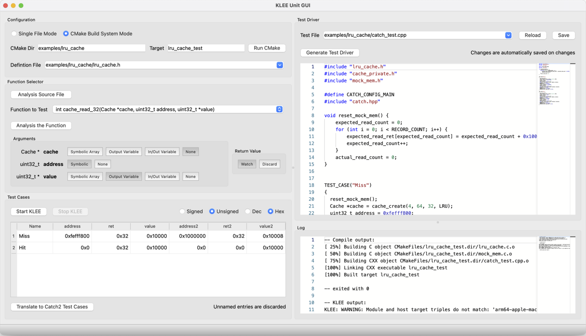

KLEE-Unit
=========

An attempt to use [KLEE](http://klee.github.io/) for unit test generation. Project of Automated Software Testing SS2022
at ETHZ.

Symbolic execution is a powerful testing technique. However, scaling it to real-world programs is yet a challenge.
The motivation of this project is to take a different direction: applying symbolic execution to small piece of code
under unit testing, which tends to have simpler control flow. The key idea is to design a user-friendly pipeline to
apply KLEE on the unit under test (UUT).

[Microsoft IntelliTest](https://learn.microsoft.com/en-us/visualstudio/test/intellitest-manual/?view=vs-2022)
is a tool in Visual Studio that takes the similar idea to generate unit tests for C#.
Similarly, KLEE-Unit is an also interactive development tool but targeting C and using KLEE as the backbone.

Primary evaluation shows that the system works for simple programs, but still suffers from path explosion without the
developer adding additional constraints on the input. Please refer to the [report](report.pdf) for details.

## Setup

The system is built upon the KLEE build system. See [KLEE README](README-KLEE.md) for details.
The main components of KLEE-Unit is in [tools/klee-unit](tools/klee-unit), plus a few modification into KLEE's source
code.